# aws_chat
A mini project incorporating AWS features like Lambda, Dynamo, S3, CloudFront and Cognito.

## Setting up a Lambda Function  

In this project, I am using Node.JS runtime. We have specified two roles for our Lambda.
We have created an S3 Policy (GetObject), which basically allows to read from a specific bucket. 
Then we created a Role that targets Lambda and add above S3 policy we created and LambdaBasicExecution policy(Allows to write to cloudwatch);

Then we creates a Lambda Function. 

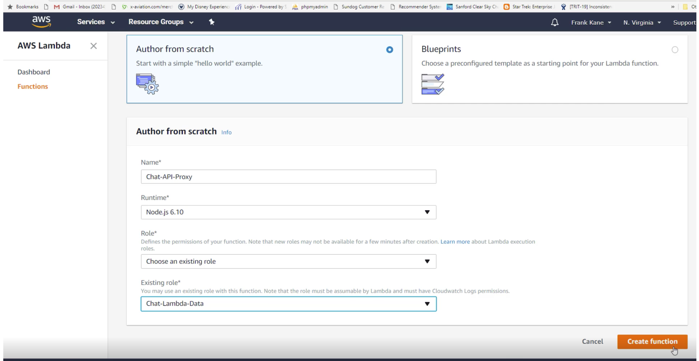

## Setting up API Gateway  

Once your Lambda function is ready. Create your API Gateway.  Select the REST API. 

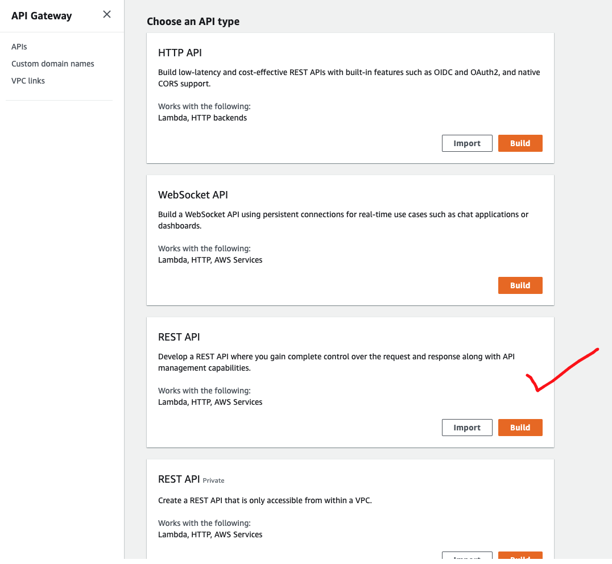

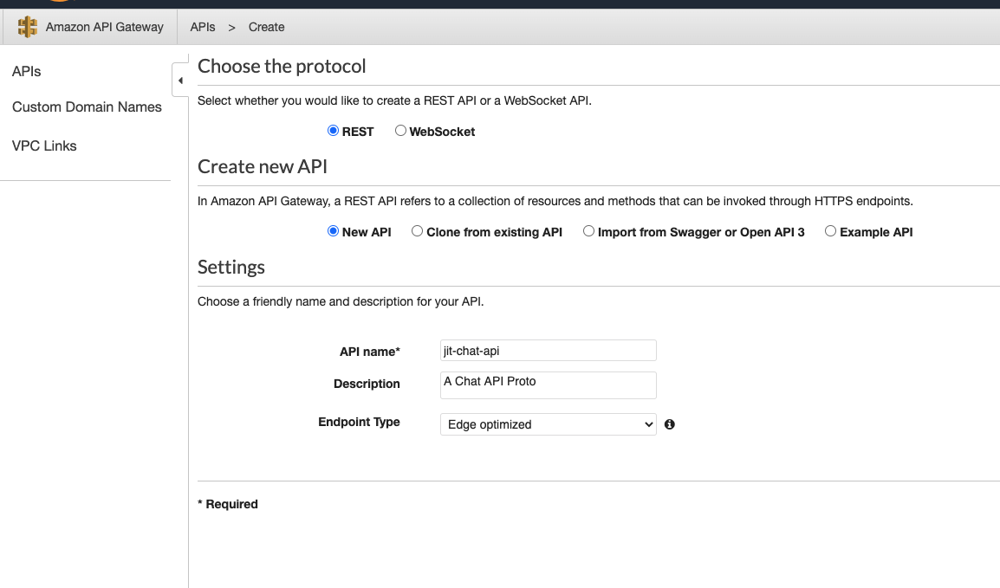

Now Actions -> Create Resource and enable proxy. (Proxy means we will get the entire request to Lambda from API Gateway).

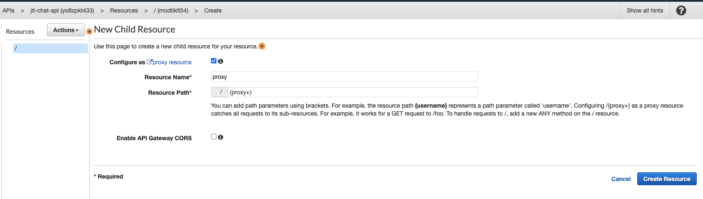

Now associate your API with Lambda.  

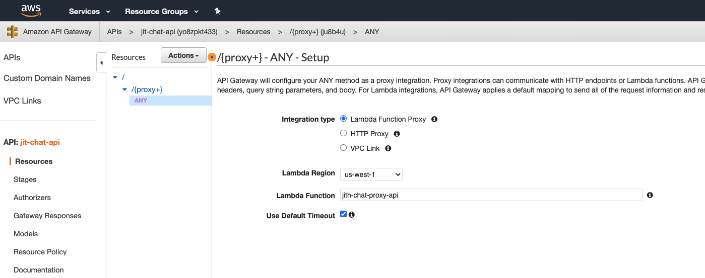  

You can test it with specify proxy path in the test.  

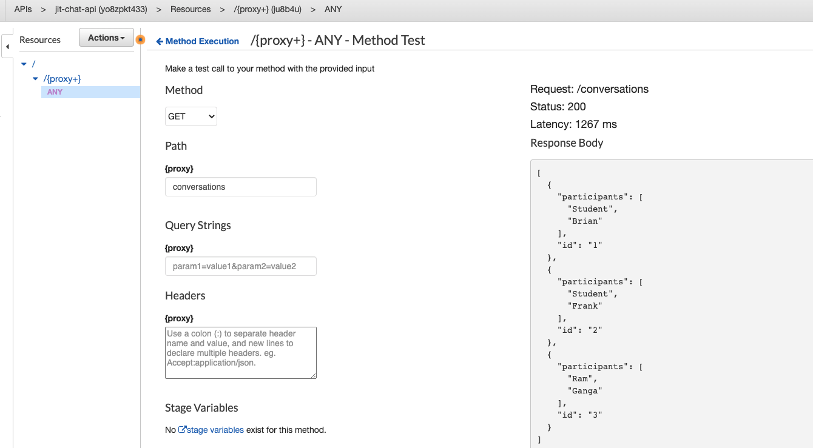  

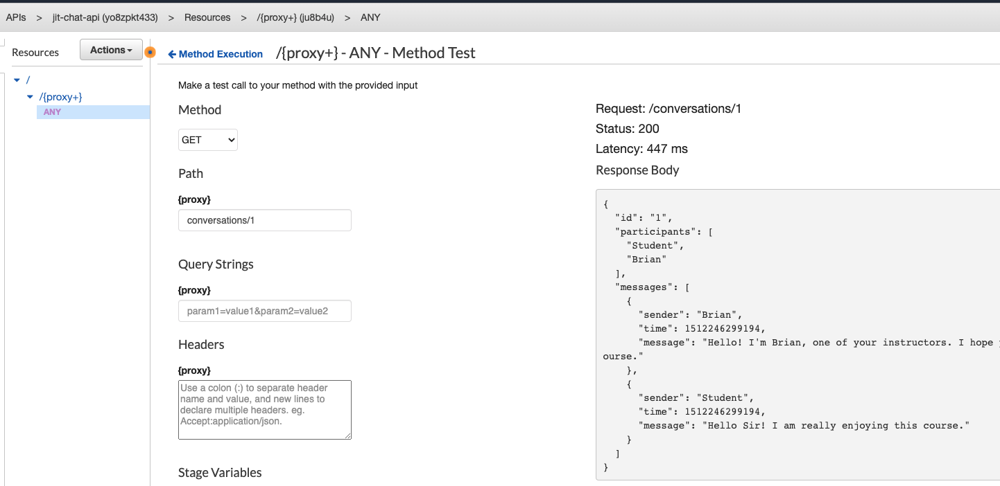 

Now enable CORS  

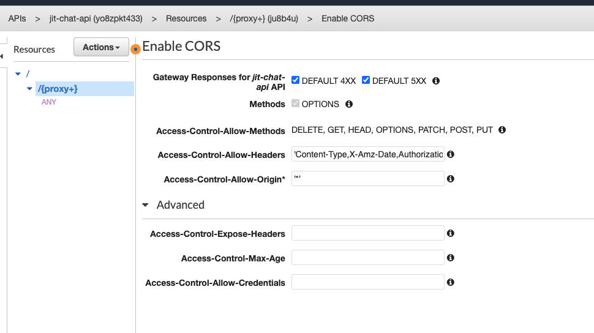  

Now ensure to deploy your API.  (Actions -> Deploy)

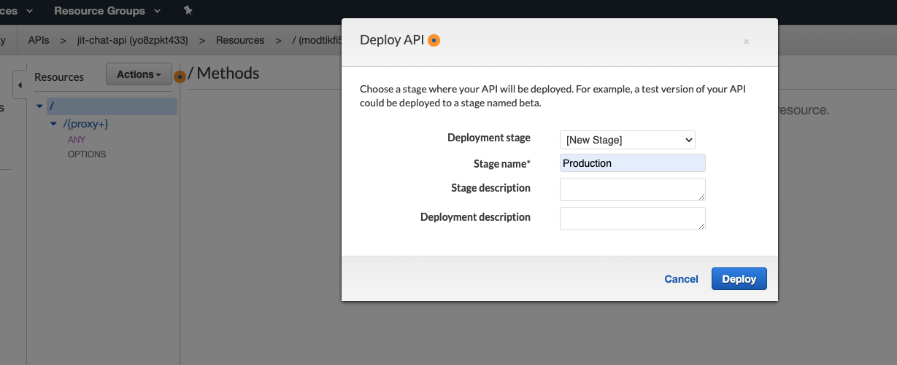

You will get the API URL from stages section.  

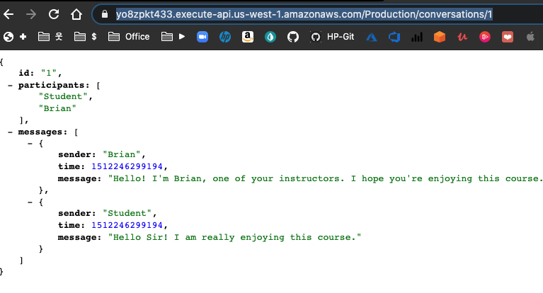  

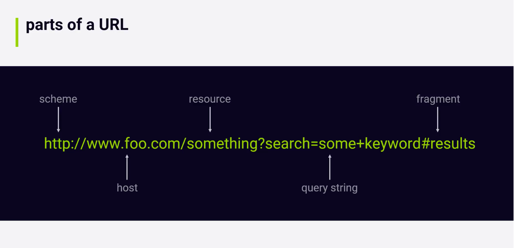

## Adding Cognito Support  

## References  

[https://learning.oreilly.com/videos/build-a-serverless/9781789348149/9781789348149-video1_1
](https://learning.oreilly.com/videos/build-a-serverless/9781789348149/9781789348149-video1_1)
